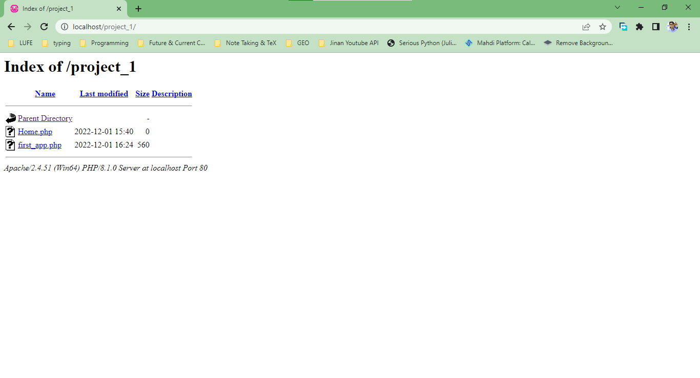

# PHP Tag
## PHP code block
```php
<?php
    // PHP code
?>
```
The PHP is very interwound with HTML. The output of every PHP code is HTML.
## Inline PHP code
It is any code enclosed by `<? ?>` or `<% %>`

## PHP code print
```php
<?php
    echo "Hello World!";
?>
```
The output of echo is placed in HTML code in place of its position.
## PHP Comments
```php
<?php
    // Comments style 1
    /*  Comments
        Style
        2
    */
    # Comments Style 3>
?>
```

## PHP Variables
### Declaration
There are three types, text, numbers or booleans, the variable should be preceeded by `$`
```php
<?php
    $text_var = "Hello";
    $number_var = 21;
    $bool_var = true;
?>
```
some variables nomeclature is similar to other languages.
### Printing variables
Just put the variable name with the `$`
```php
<?php
    $my_age = 21;
    echo "My age is $my_aga";
?>
```

# WAMP
projects should be created in `C:\wamp64\www\`, starting with the project `project_1`

if we navigate to https://localhost/project_1 we'll get a page displaying the local directory


however if there's `index.php` in the projects directory it is loaded instead of the directory navigator.

[Code Here](./codes/session_2/index.php)

# PHP Operators
All operators should be placed outside "string quotations"
## concatenation operator
```php
<?php
    $string_1 = "string1";
    $string_2 = "string2";
    echo "$string1".string2;
    // The output will be string1string2
    echo $string.$string2;
    // the outpue will be string2string2

    $number_1 = 5;
    $number_2 = 10;
    echo $number1.$number2;
    // the output will be 510

    echo $string1.$number1;
    // the output will be string15
?>
```
## Arithematic Operator
Same as C `+ - * / %`

## Logical Operators
Same as C `&& || !`

## Comparison Operator
Same as C `< <= > => == !=`

# PHP Conditionals
Similar to C
```php
<?php
if (condition 1){

}
else if (condition 2){

}
?>
```

# PHP Loops
```php
<?php
for ($i = 0; $i< N; i++){

}

while (condition){

}

do{

}while (condition);
?>
```

# Form Submitting
```html
<form aciton="home.php" method="get">
    name: <input type="text" name="username">
    email: <input type="text" name="email">
    <input type="submit" name="submit" values="read">
</form>
```
Pressing submit will let the server receive them as
```php
$_GET["username"];
$_GET["email"];
$_GET["submit"];
```

pressing the submit button will send us to the page inside the action argument of the form target. On this page (in the example `home.php`) we check if the variables `$_GET[...]` exist in that page though
```php
isset($_GET[...])
```
which returns true or false, which we can process depending on the result.  
The `$_GET[...]` variables are read-only.  
It is recommended that we assign the form values to anther variables for better code writing
```php
$user = $_GET["username"];
$email = $_GET["email"];
$submit = $_GET["submit"];
```

